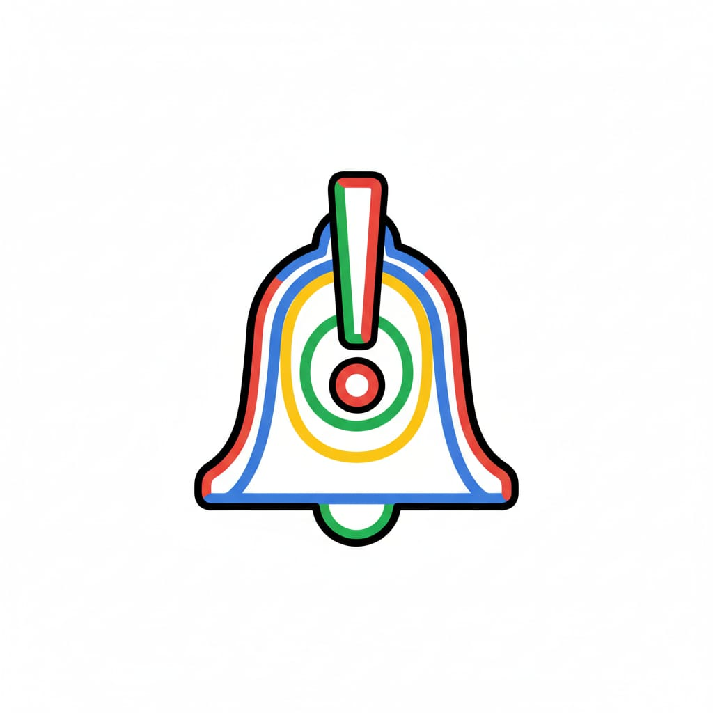

# BellsNotice

<div align="center">

**A Modern Notice Board Platform for Educational Institutions**



[](https://nextjs.org/)
[](https://react.dev/)
[](https://www.typescriptlang.org/)
[](https://supabase.com/)
[](https://tailwindcss.com/)

[Live Demo](https://bellsnotice.vercel.app/) • [Report Bug](https://github.com/Greatness0123/bellsnotice/issues) • [Request Feature](https://github.com/Greatness0123/bellsnotice/issues)

</div>

---

## Table of Contents

- [About The Project](#about-the-project)
- [Features](#features)
- [Screenshots](#screenshots)
- [Tech Stack](#tech-stack)
- [Getting Started](#getting-started)
- [Environment Variables](#environment-variables)
- [Database Schema](#database-schema)
- [Project Structure](#project-structure)
- [Contributing](#contributing)
- [License](#license)
- [Contact](#contact)

---

## About The Project

BellsNotice is a comprehensive, modern notice board platform designed specifically for educational institutions. Built with cutting-edge web technologies, it provides an intuitive and efficient way for students, faculty representatives, and administrators to create, share, and manage important announcements and information.

### Key Highlights

-  **Secure Authentication**: Role-based access control with Supabase Auth
-  **Responsive Design**: Fully responsive across all devices with PWA support
-  **Modern UI**: Beautiful interface built with Tailwind CSS and shadcn/ui
-  **Rich Media Support**: Images, videos, and documents in notices
-  **Advanced Search**: Full-text search with powerful filtering
-  **Analytics**: Track notice views and engagement
-  **Interactive**: Comments, reactions, and save functionality
-  **Organization**: Tags, categories, and smart filtering

### Target Audience

- **Students**: View, search, comment on, and save notices
- **Representatives**: Create and manage notices, handle requests
- **Administrators**: Full control over all notices and system oversight

---

## Features

### For All Users

-  **Advanced Search**: Full-text search across all notices
-  **Smart Filtering**: Filter by tags, department, date, and more
-  **Save Notices**: Bookmark notices for later viewing
-  **Comments**: Engage with notices through comments
-  **Reactions**: Like and react to notices
-  **User Profiles**: View and manage personal profiles
-  **Dark Mode**: Eye-friendly dark mode support
-  **PWA**: Install as a mobile app for offline access

### For Representatives (Reps)

-  **Create Notices**: Publish notices with rich media
-  **Media Upload**: Upload images, videos, and documents
-  **Tagging**: Organize notices with custom tags
-  **Manage Requests**: Review and approve notice requests
-  **Analytics**: View statistics for published notices
-  **Edit & Delete**: Full control over your notices
-  **Request Handling**: Accept or decline user requests with feedback

### For Administrators

-  **Full Control**: Create, edit, delete any notice
-  **Featured Content**: Mark notices as important or featured
-  **Admin Panel**: Dedicated dashboard for system management
-  **System Analytics**: Overall platform statistics
-  **Override**: Override representative decisions on requests


## Tech Stack

### Frontend
- **Framework**: Next.js 16.0.10 (App Router)
- **UI Library**: React 19.2.0
- **Language**: TypeScript 5
- **Styling**: Tailwind CSS 4.1.9
- **Components**: Radix UI + shadcn/ui
- **Icons**: Lucide React
- **Forms**: React Hook Form + Zod validation
- **Charts**: Recharts (Analytics)

### Backend & Database
- **Backend-as-a-Service**: Supabase
- **Database**: PostgreSQL
- **Authentication**: Supabase Auth
- **Storage**: Supabase Storage
- **Real-time**: Supabase Realtime

### Additional Tools
- **PWA**: next-pwa 5.6.0
- **Analytics**: Vercel Analytics
- **Date Handling**: date-fns 4.1.0
- **Notifications**: sonner 1.7.4
- **Type Validation**: Zod 3.25.76

---

## Getting Started

### Prerequisites

- Node.js 18+ and npm
- Supabase account (free tier works)
- Git

### Installation

1. **Clone the repository**

```bash
git clone https://github.com/Greatness0123/bellsnotice.git
cd bellsnotice
```

2. **Install dependencies**

```bash
npm install
```

3. **Set up Supabase**

   - Create a new project at [supabase.com](https://supabase.com)
   - Go to Project Settings > API
   - Copy your project URL and anon key

4. **Set up environment variables**

   Create a `.env.local` file in the root directory:

```bash
NEXT_PUBLIC_SUPABASE_URL=your-supabase-project-url
NEXT_PUBLIC_SUPABASE_ANON_KEY=your-supabase-anon-key
```

5. **Set up database tables**

   Run the SQL queries provided in [DATABASE_SCHEMA.md](#database-schema) in your Supabase SQL editor.

6. **Set up storage**

   - Create a storage bucket named `bellsnotice`
   - Make it public
   - Create folders: `profiles/`, `images/`, `videos/`, `files/`

7. **Run the development server**

```bash
npm run dev
```

8. **Open your browser**

Navigate to [http://localhost:3000](http://localhost:3000)

---

## Environment Variables

Create a `.env.local` file in the root directory:

```bash
# Supabase Configuration
NEXT_PUBLIC_SUPABASE_URL=your-supabase-project-url
NEXT_PUBLIC_SUPABASE_ANON_KEY=your-supabase-anon-key
```

### Getting Supabase Credentials

1. Go to [supabase.com](https://supabase.com) and sign in
2. Create a new project
3. Navigate to Project Settings > API
4. Copy:
   - Project URL
   - anon public key (not the service_role key!)

---

## Database Schema

### Core Tables

#### profiles
User profiles with academic information

```sql
CREATE TABLE profiles (
  id UUID PRIMARY KEY REFERENCES auth.users(id),
  email TEXT,
  display_name TEXT,
  user_type TEXT DEFAULT 'user',
  level TEXT,
  program TEXT,
  college TEXT,
  department TEXT,
  matric_number TEXT,
  profile_image_url TEXT,
  read_receipt_visibility BOOLEAN DEFAULT true,
  created_at TIMESTAMP DEFAULT NOW()
);
```

#### notices
Main notices table

```sql
CREATE TABLE notices (
  id UUID PRIMARY KEY DEFAULT gen_random_uuid(),
  title TEXT NOT NULL,
  description TEXT NOT NULL,
  author_id UUID REFERENCES profiles(id),
  view_count INTEGER DEFAULT 0,
  is_important BOOLEAN DEFAULT false,
  is_featured BOOLEAN DEFAULT false,
  expires_at TIMESTAMP,
  created_at TIMESTAMP DEFAULT NOW()
);
```

#### notice_media
Media files associated with notices

```sql
CREATE TABLE notice_media (
  id UUID PRIMARY KEY DEFAULT gen_random_uuid(),
  notice_id UUID REFERENCES notices(id) ON DELETE CASCADE,
  media_type TEXT NOT NULL,
  media_url TEXT NOT NULL,
  is_link BOOLEAN DEFAULT false,
  created_at TIMESTAMP DEFAULT NOW()
);
```

#### notice_requests
Requests from users to create notices

```sql
CREATE TABLE notice_requests (
  id UUID PRIMARY KEY DEFAULT gen_random_uuid(),
  title TEXT NOT NULL,
  description TEXT NOT NULL,
  requester_id UUID REFERENCES profiles(id),
  rep_id UUID REFERENCES profiles(id),
  status TEXT DEFAULT 'pending',
  response_message TEXT,
  responded_at TIMESTAMP,
  notice_id UUID REFERENCES notices(id),
  created_at TIMESTAMP DEFAULT NOW()
);
```

#### tags
Notice tags for categorization

```sql
CREATE TABLE tags (
  id UUID PRIMARY KEY DEFAULT gen_random_uuid(),
  name TEXT UNIQUE NOT NULL,
  created_at TIMESTAMP DEFAULT NOW()
);
```

#### notice_tags
Many-to-many relationship between notices and tags

```sql
CREATE TABLE notice_tags (
  notice_id UUID REFERENCES notices(id) ON DELETE CASCADE,
  tag_id UUID REFERENCES tags(id) ON DELETE CASCADE,
  created_at TIMESTAMP DEFAULT NOW(),
  PRIMARY KEY (notice_id, tag_id)
);
```

#### comments
Comments on notices

```sql
CREATE TABLE comments (
  id UUID PRIMARY KEY DEFAULT gen_random_uuid(),
  content TEXT NOT NULL,
  user_id UUID REFERENCES profiles(id),
  notice_id UUID REFERENCES notices(id) ON DELETE CASCADE,
  created_at TIMESTAMP DEFAULT NOW()
);
```

#### reactions
User reactions to notices

```sql
CREATE TABLE reactions (
  id UUID PRIMARY KEY DEFAULT gen_random_uuid(),
  user_id UUID REFERENCES profiles(id),
  notice_id UUID REFERENCES notices(id) ON DELETE CASCADE,
  created_at TIMESTAMP DEFAULT NOW(),
  UNIQUE(user_id, notice_id)
);
```

#### saved_notices
Bookmarks for users

```sql
CREATE TABLE saved_notices (
  user_id UUID REFERENCES profiles(id) ON DELETE CASCADE,
  notice_id UUID REFERENCES notices(id) ON DELETE CASCADE,
  created_at TIMESTAMP DEFAULT NOW(),
  PRIMARY KEY (user_id, notice_id)
);
```

### Row Level Security (RLS) Policies

Enable RLS and add policies for secure data access.

---

## Project Structure

```
bellsnotice/
├── app/                          # Next.js App Router
│   ├── auth/                    # Authentication pages
│   │   ├── sign-up/            # Registration
│   │   └── sign-up-success/    # Success page
│   ├── dashboard/              # User dashboard
│   ├── filter/                 # Notice filtering
│   ├── notice/                 # Notice operations
│   │   ├── [id]/              # Notice details
│   │   │   └── edit/         # Edit notice
│   │   └── create/           # Create notice
│   ├── notices/                # All notices listing
│   ├── profile/                # User profiles
│   ├── request-notice/         # Submit notice requests
│   ├── saved/                  # Saved notices
│   ├── search/                 # Search functionality
│   ├── admin/                  # Admin panel
│   ├── globals.css            # Global styles
│   └── layout.tsx             # Root layout
├── components/                  # React components
│   ├── ui/                     # shadcn/ui components
│   ├── pages/                  # Page-specific components
│   │   ├── home-page.tsx      # Home page
│   │   └── login-page.tsx     # Login page
│   ├── navigation/             # Navigation components
│   ├── notice-card.tsx         # Notice card component
│   ├── notice-create-modal.tsx # Create notice modal
│   ├── admin-notice-manager.tsx # Admin notice manager
│   └── top-navbar.tsx          # Top navigation bar
├── lib/                         # Utilities
│   ├── supabase/              # Supabase clients
│   │   ├── client.ts         # Browser client
│   │   └── server.ts         # Server client
│   └── utils.ts              # Helper functions
├── hooks/                       # Custom hooks
│   ├── use-toast.ts          # Toast notifications
│   └── use-mobile.ts         # Mobile detection
├── public/                      # Static assets
│   └── images/                # Images and icons
├── styles/                      # Additional styles
├── .gitignore                   # Git ignore file
├── package.json                 # Dependencies
├── tsconfig.json               # TypeScript config
├── next.config.mjs             # Next.js config
├── tailwind.config.ts          # Tailwind config
├── postcss.config.mjs          # PostCSS config
└── README.md                   # This file
```
---

## Contributors
  Okorie Greatness <br>
  GitHub: [@Greatness0123](https://github.com/Greatness0123)<br>
  Lawal Aisha<br>
  GitHub: [@Aisha-Lawal-Al](https://github.com/Aisha-Lawal-Al)<br>
  Adeleke Folasayo<br>
  GitHub: [@fola-alt](https://github.com/fola-alt)<br>
  Alao Labeebah Anjolaoluwa<br>
  GitHub: [@KRTLAB](https://github.com/KRTLAB)<br>
  Onashoga Ifemipo<br>
  GitHub: [@ifemipo](https://github.com/ifemipo)<br>
  Adebeshin Ifeoluwa<br>
  GitHub: [@MERCYYY2008](https://github.com/MERCYYY2008)<br>
  
 

---


---

## Contributing

Contributions are what make the open-source community such an amazing place to learn, inspire, and create. Any contributions you make are **greatly appreciated**.

### How to Contribute

1. Fork the Project
2. Create your Feature Branch (`git checkout -b feature/AmazingFeature`)
3. Commit your Changes (`git commit -m 'Add some AmazingFeature'`)
4. Push to the Branch (`git push origin feature/AmazingFeature`)
5. Open a Pull Request

### Development Guidelines

- Follow the existing code style
- Write clear, descriptive commit messages
- Add comments for complex logic
- Test your changes thoroughly
- Update documentation as needed

---

## 📝 License

Distributed under the MIT License. See `LICENSE` for more information.

---

<!-- ## 👨‍💻 Author

**Greatness**

- GitHub: [@Greatness0123](https://github.com/Greatness0123)
- Project Link: [https://github.com/Greatness0123/bellsnotice](https://github.com/Greatness0123/bellsnotice) -->

---

## Acknowledgments

- [Next.js](https://nextjs.org/) - The React framework
- [Supabase](https://supabase.com/) - Backend as a Service
- [shadcn/ui](https://ui.shadcn.com/) - UI component library
- [Tailwind CSS](https://tailwindcss.com/) - Utility-first CSS framework
- [Radix UI](https://www.radix-ui.com/) - Unstyled, accessible UI components

---

## Support

If you have any questions or need help, please:

1. Check the [documentation](#documentation)
2. Search existing [issues](https://github.com/Greatness0123/bellsnotice/issues)
3. Create a new [issue](https://github.com/Greatness0123/bellsnotice/issues)

---

## Star History

[](https://star-history.com/#Greatness0123/bellsnotice&Date)

---

<div align="center">

**Built with ❤️ for Bells University of Technology**

[⬆ Back to Top](#-bellsnotice)

</div>